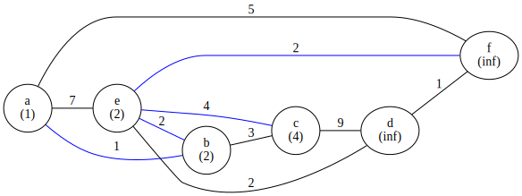

# Algorithms and Data Structures Assignment 03

Third assignment for AlgoDat, Summer Semester 2020.

Task:  Implement a **graph** and the **Prim** and **Bellmann-Ford**
algorithms.

## building
```sh
mkdir build
cd build
cmake ..
make
```

Executables will be in `build/source`.

## Bellmann-Ford

For a given starting node _v_, the Bellmann-Ford algorithm finds the
shortest paths to all nodes that can be reached from _v_.

This is the example output produced by the `bell` executable, with _a_
as the starting node:


Blue vertices are part of the shortest paths.  The number below each
node's label is the distance of the shortest path from _a_ to that node.
E.g., the shortest path from _a_ to _c_ is via _e_ and has a cost of
`7 + 4 = 12`.

## Prim

Prim finds the minimum spanning tree, i. e. a tree connecting all nodes
such that the sum of weights within the tree is minimal.


